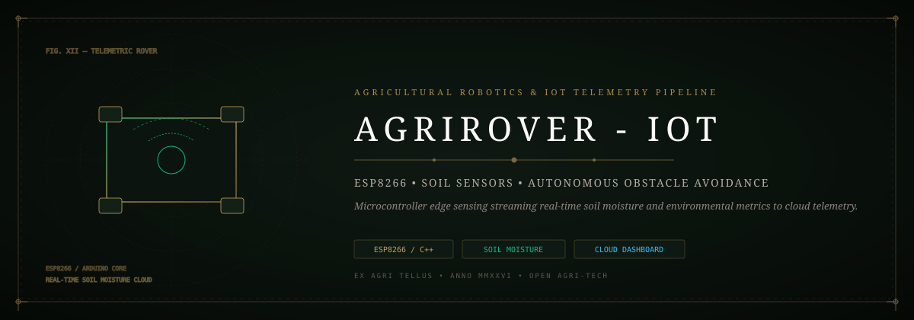
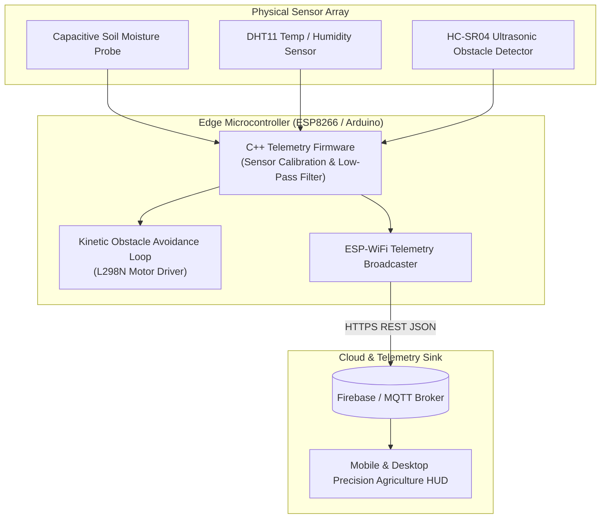

# 📡 AgriRover-IoT: Autonomous Agricultural Telemetry Pipeline
### *Edge Sensor Ingestion, Microcontroller Firmware & Precision Irrigation Cloud Dashboard*

*An autonomous agricultural rover and edge sensing pipeline streaming soil moisture, ambient humidity, and obstacle telemetry to live monitoring dashboards.*

---

## ⚡ The Architectural Vision

Smallholder agriculturalists frequently lack affordable, real-time soil moisture and microclimate telemetry, leading to wasteful over-irrigation or catastrophic crop desiccation. Commercial ag-tech systems cost thousands and depend on proprietary, locked clouds.

**AgriRover-IoT** delivers an accessible, open-hardware telemetry solution:
- **Autonomous Navigation**: Ultrasonic obstacle avoidance guiding rover traversal across rough terrain.
- **Multimodal Soil Telemetry**: Capacitive soil moisture, DHT11 ambient temperature/humidity, and light intensity probes.
- **Resilient Edge Ingestion**: ESP8266 microcontroller streaming telemetry packets over Wi-Fi with local offline caching.

---

## 🏗️ Telemetry Data Pipeline

---

## 🧩 Antigravity Skills & Tooling

- **`performance-profiling`**: Microsecond loop execution bounds preventing motor stall conditions.
- **`systematic-debugging`**: Signal filtering eliminating analog ADC noise on capacitive moisture probes.
- **`diagram-design`**: Full hardware schematics and telemetry flow.

---

## 📦 Hardware & Dependencies

- **Microcontroller**: ESP8266 NodeMCU / Arduino Uno
- **Sensors**: Capacitive Moisture Sensor v1.2, DHT11, HC-SR04
- **Actuators**: L298N Dual H-Bridge Motor Driver, 4x DC Geared Motors
- **Libraries**: `ESP8266WiFi.h`, `FirebaseArduino.h`, `DHT.h`

---

## 🛡️ Security & Reliability

1. **Offline Telemetry Buffering**: Sensors log to internal EEPROM when Wi-Fi connection is dropped.
2. **Watchdog Timer**: Automated hardware watchdog reset prevents microcontroller hangs in outdoor field environments.
3. **Sanitized REST Payload**: Payload boundaries prevent buffer overruns on low-memory SRAM.

---

## 📄 License

Distributed under the [MIT License](LICENSE). Maintained by [Jaswanth Reddy](https://github.com/Jaswanth1902) — *Passionate learner & creative problem solver learning from and giving back to the open-source community.*
